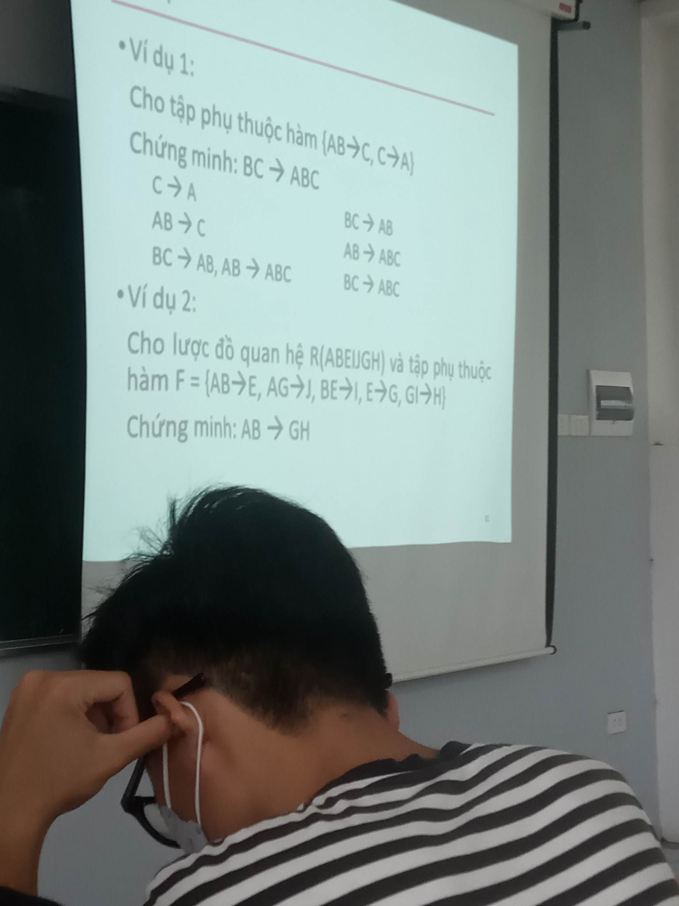
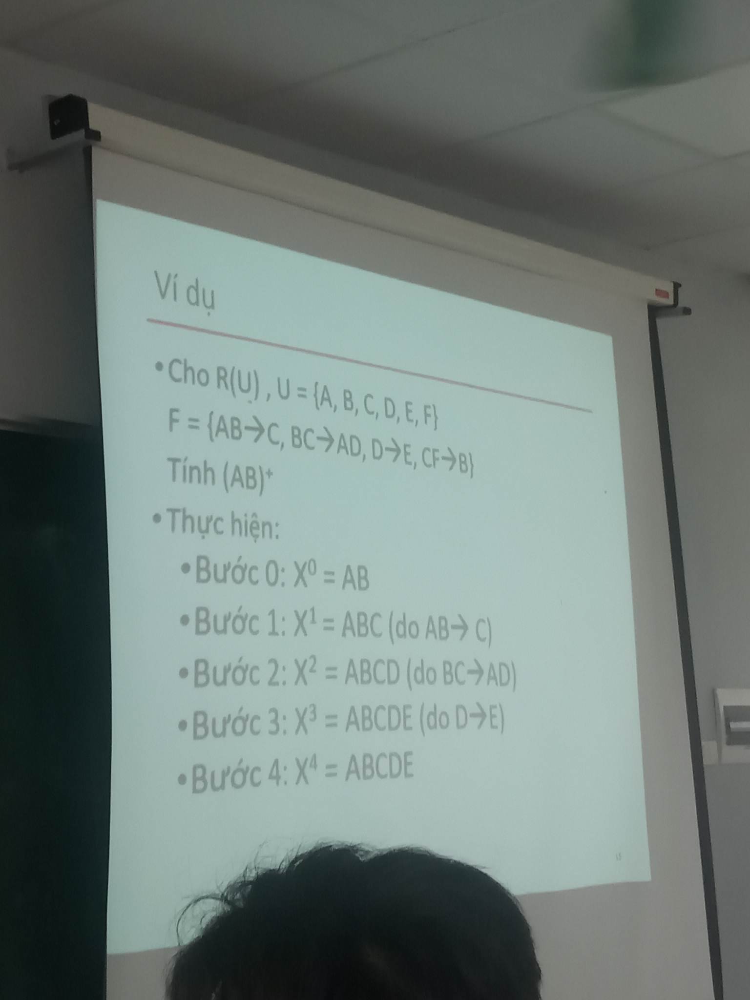
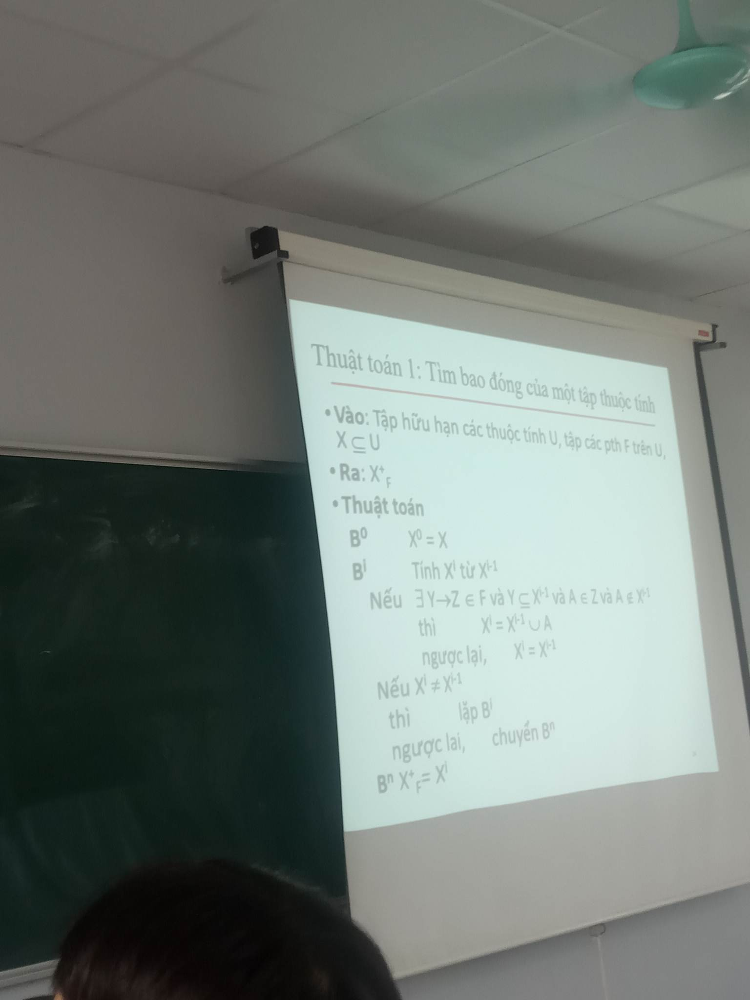
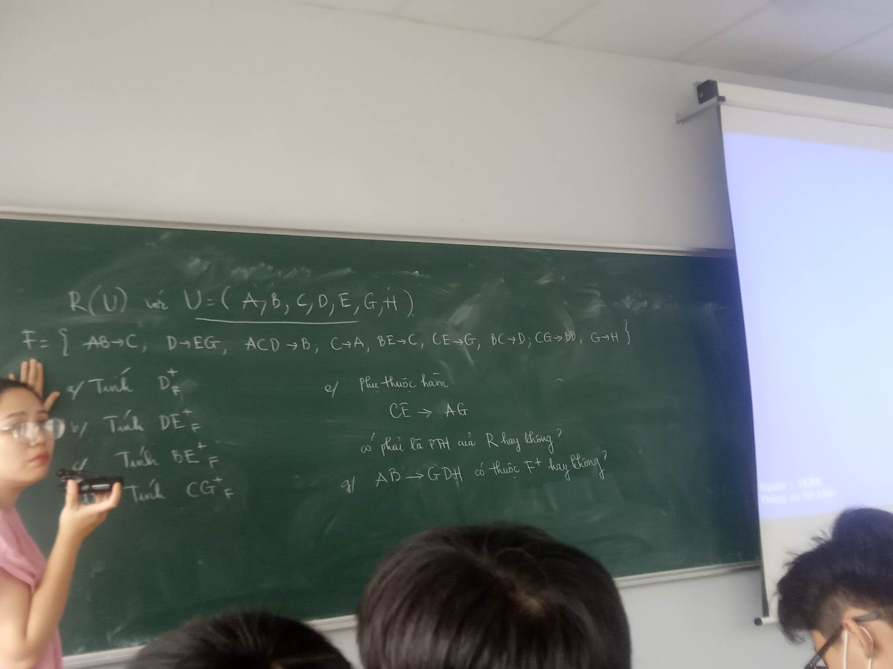

| SID  |  Sname | City | numberOfEmps | Product | Quantity |
|---|---|---|---|---|---|
|  $s1  |  Johnson  | New York | 100 | Vegetable |  100 |
|  $s1  |  Johnson  | New York | 35 | Apple |  200 |
|  $s2  |  James  | New York | 40 | Banana |  140 |
|  $s3  |  Watson  | Berlin | 20 | Strawberry |  100 |
|  $s4  |  Johnson  | Jakarta | 60 | Kiwi |  40 |

Tổ chức kiểu 'nhồi thịt'

____
### Supplier(sid, sname, city, product, quantity, numberOfEmps)
___

> Tổ chức như trên sẽ thấy : 
+ __Dư thừa dữ liệu. Khi 1 ông cùng cung cấp nhiều món, lưu nhà, tuổi là thừa quá__
+ __Phình dữ liệu. Cái này ko nghe vì ko để ý.__
+ __Khó khăn cho server khi truy cập(do bảng to quá)__
+ Khi sửa 1 bộ dữ liệu. Giả sử 1 ngừoi đổi chỗ ở --> sửa all dòng của người đó. Nếu bỏ sót 1 dòng --> gây lỗi `1 ngừoi 2 nhà`

__Điểm cộng duy nhất chắc là tìm kiếm dễ dàng__

#  1 cách fix :
+ Tạo 2 bảng Supplier(sid, sname, city, numberOfEmps) và Supply(sid, product, quantity)

__Bất lợi : tìm kiếm sẽ phải kết nối 2 bảng --> Giảm tốc độ__

### Mục đích của việc chuẩn hóa là xác định đc 1 tập các bảng cho phép tìm kiếm thông tin dễ dàng nhưng phải tránh __dư thừa dữ liệu__
- Từ 1 LDQH chưa chuẩn -> Tách thành các LDQH chuẩn hơn.

--> Kĩ thuật Phụ thuộc hàm (functional dependencies) : nhận biết các LDQH chưa chuẩn

`FD : Cho R(U) là 1 sdqh với U là tập thuộc tính {A1, A2, ... An} . X, Y là tập con 0 rỗng. X xác định Y (X -> Y) nếu có 1 quan hệ r xác định trên R(U), với 2 bộ t1, t2 bất kì thuộc r mà : `

`t1[X] = t2[X] thì phải có t1[Y] = t2[Y].`

**Ở bảng trên, ta có sid -> sname, city**

___
## Đề

___
## Giải

__Đề dạng text()__
Cho AB->C, C-> A. Cm BC -> ABC.
___

__Duy tự giải__

>AB -> C      
>    ==> ABC -> C, C -> A 

>    ==> ABC -> A 

>    ==> BC -> A

> BC -> BC, BC -> A

> ==> BC -> ABC

___

### Cô chữa
AB -> C --> AB -> ABC
C -> A --> BC -> AB
BC -> ABC

# Hệ tiên đề Amstrong

+ `Y C_ X` -->   `X -> Y`
+ `X -> Y` -->   `XZ -> YZ`
+ `X -> Y, Y-> Z` --> `X -> Z`

## Hệ quả : 
+ `X -> Y, X -> Z` --> `X -> YZ`
+ `X -> Y, WY -> Z` --> `XW -> Z`
+ `X -> Y, Z C_ Y` --> `X -> Z`

## CHo R(ABEIJGH) và tập phụ thuộc F = AB -> E, AG -> J, BE -> I, E -> G, GI -> H. 
## CM :    `AB -> GH`

AB -> E, E -> G ==> AB -> G
AB -> E ==> AB -> BE
AB -> BE, BE -> I ==> AB -> I
AB -> G, AB -> I ==> AB -> GI
GI -> H, AB -> GI ==> AB -> H
AB -> G, AB -> H ==> AB -> GH

### Thuật toán tìm bao đóng
___

### VD : 
R(U) , U = {A, B, C, D, E, F}

F = {AB -> C, BC -> AD, D -> E, CF -> B}

__Tính AB+F (Cho AB xem tìm đc ku nào nữa trong F)__
> B0: AB0 = {AB}. Lấy từ trái sang phải 

> B1: Tính AB1 từ AB0

    - Có pth AB -> C trong F, thỏa mãn AB C_ AB0; C !C_ AB0;
    --> AB1 = AB0 push C = {ABC}

> B2: Tính AB2 từ AB1

    - BC -> AD trong F, VT = ABC C_ AB1; D !C_ AB1;
    --> AB2 = {ABCD}

> B3: AB3 = {ABCDE}

> B4: AB4 = AB3

-->` KL: AB+F = {ABCDE}`

__BTVN__
