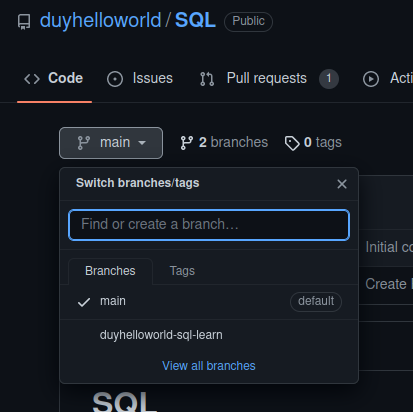
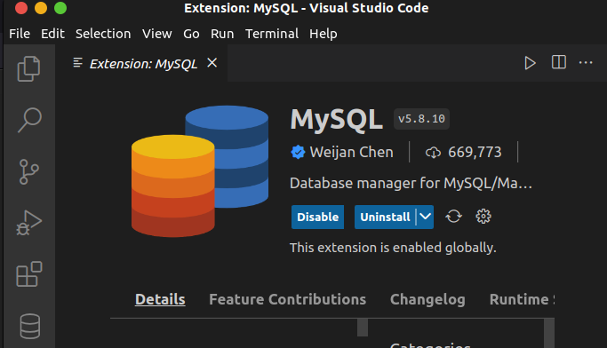
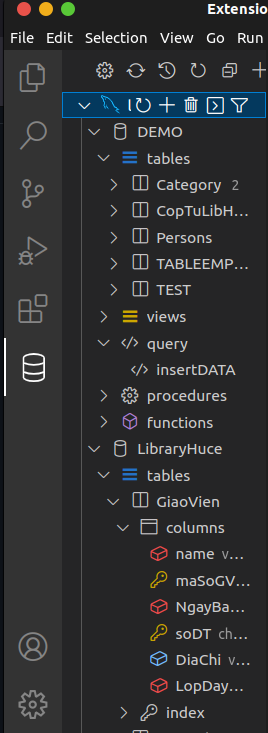

# SQL
learn SQL basic, post here for Hiep, Linh and anyone who want to learn can read and feedback to me!
## Chỉnh branch để coi cái code :))

## Download MySQL + cái extension này để học đồng bộ nhá ##

## Thành tựu của anh Ad đẹp trai nè ##

=======
# SQL_learning

[Full HD ko che](https://www.youtube.com/playlist?list=PLE1qPKuGSJaDkQQB5vK7t7-PRIVjtqeHB)

## Thứ tự học: 
- Thích học gì trước cũng đc 
- kiểu dữ liệu xem riêng 1 [bài giảng](https://youtu.be/_40bzGOHloo?t=24)
- Lộ trình của tớ :
  1. [CRUD](/CRUD) + vài lệnh SELECT cơ bản để in ra
  2. [ALTER](/AlterTable)
  3. [CONSTRAINT](/Constraint)
  4. [SELECT](/Select)
